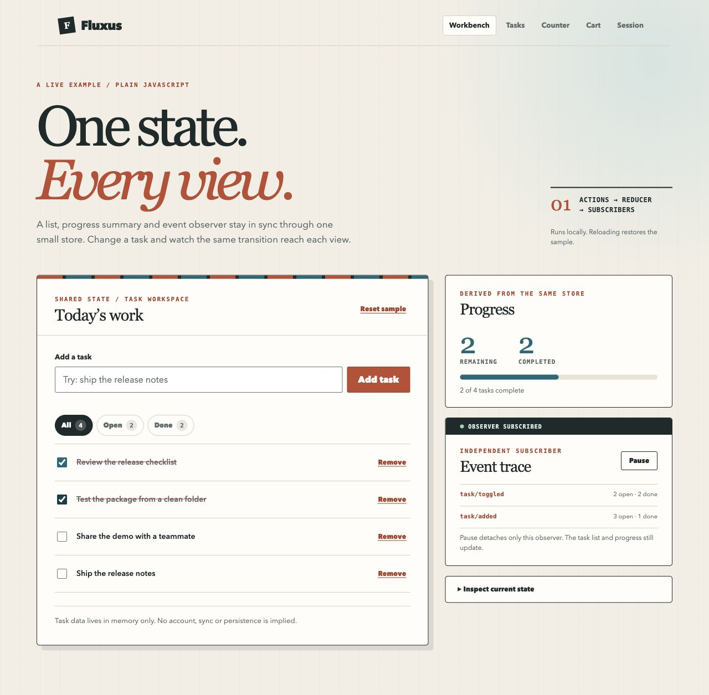
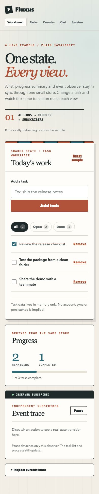

# Task workbench walkthrough

The main demo is [`examples/workbench.html`](../examples/workbench.html). It runs from the built local repository and uses the actual `dist/index.mjs` entry point. From a clone, run:

```bash
yarn install --frozen-lockfile
yarn build
python3 -m http.server 8000
```

Open `http://localhost:8000/examples/workbench.html`. The browser must load it through the local HTTP server; opening the file directly does not give the module import the same origin. The demo needs no external CSS, font, API or account. Reloading restores three sample tasks.

## Reproducible interaction

1. Initial state: 3 tasks, 2 open, 1 done; event trace empty.
2. Add `Ship the release notes`: 4 tasks, 3 open; `task/added` appears in the event trace. The task list and progress are separate store subscribers.
3. Choose **Open** and complete the new task: it leaves the filtered list, progress becomes 2 of 4, and `task/toggled` appears. Focus moves to the selected filter when the checkbox disappears.
4. Press **Pause** in the event trace, add another task, and observe that the task list and progress update while the trace stays unchanged. **Resume** subscribes the observer again; the next action appears in its trace.
5. Press **Reset sample**: the original three tasks, filter and next task ID return. The trace starts again with `sample/reset` if subscribed. Reload has the same state reset but clears the trace.

The `createReducer` handlers, stable selectors and distinct subscribers are in [`examples/workbench.js`](../examples/workbench.js). Task titles are inserted with `textContent`; the browser test used `<b>Ship Fluxus</b>` and observed literal text with no child element. There is no persistence or remote service. The sample task text is fixture data, not proof of a release or external tester.

## Captured states

These are unaltered browser captures from the locally built demo on 19 September 2026. The [capture record](assets/README.md) gives the source revision, dimensions and hashes.

Initial state, with three sample tasks and an empty event trace:


After adding `Ship the release notes` and completing `Test the package from a clean folder`, the list has four tasks, two completed and two open; the event trace shows both dispatched actions:



The same initial state at 390 px browser width:



## Local browser checks

On 19 September 2026 in Chrome against a local HTTP server, adding, filtering, completing, removing, pausing/resuming the observer, reset and reload all produced the expected visible state. The console showed no warnings or errors. Enter submitted the add form and restored focus to the input. A filtered task that disappeared after completion returned focus to the active filter. At 390 px and 320 px wide, the page had no horizontal overflow and controls remained visible. The [visual and accessibility record](ACCESSIBILITY_QA.md) contains the focus, empty-state and contrast checks. Public hosting and final-release capture after publication remain separate roadmap tasks.
